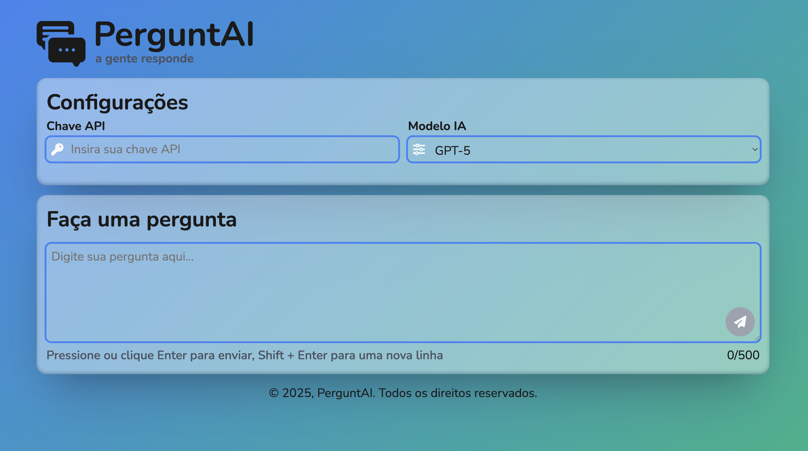

# PerguntAI

Um assistente de perguntas e respostas baseado em modelos da OpenAI,
desenvolvido em HTML, CSS e JavaScript puro.



## Live Preview

[View Live Application](https://leoandradej.github.io/assitente-ia/)

## 📌 Funcionalidades

- Inserir **chave de API** da OpenAI diretamente na interface.\
- Selecionar entre diferentes **modelos de IA** disponíveis.\
- Fazer perguntas de até **500 caracteres**.\
- Receber respostas em tempo real, exibidas de forma clara e
  estilizada.\
- Botão de **Nova Pergunta** para reiniciar a interação.\
- Validações automáticas de chave de API e campo de texto.

## 🚀 Tecnologias utilizadas

- **HTML5** -- Estrutura da aplicação\
- **CSS3** -- Estilização responsiva com variáveis e efeitos visuais\
- **JavaScript (Vanilla)** -- Lógica de interação, requisições à API e
  validações\
- **Font Awesome** -- Ícones na interface\
- **Google Fonts (Nunito & Playfair Display)** -- Tipografia

## 📂 Estrutura do projeto

    /
    ├── index.html     # Estrutura principal do app
    ├── style.css      # Estilos e responsividade
    ├── script.js      # Lógica de funcionamento
    ├── images/        # Logo e outros assets visuais
    └── README.md      # Documentação do projeto

## ⚙️ Como usar

1.  Clone este repositório:

    ```bash
    git clone https://github.com/seu-usuario/assistente-ia.git
    ```

2.  Abra o arquivo **`index.html`** no navegador.\

3.  Insira sua **chave de API da OpenAI** no campo apropriado.\

4.  Escolha o modelo de IA desejado.\

5.  Digite sua pergunta e pressione **Enter** (ou clique no botão de
    envio).

> 💡 Dica: use **Shift + Enter** para adicionar uma nova linha dentro da
> pergunta.

## 🛠️ Requisitos

- Navegador moderno com suporte a **Fetch API** e **ES6+**\
- Uma **chave de API válida** da OpenAI ([como
  obter](https://platform.openai.com/account/api-keys))

## 🔒 Tratamento de erros

- **401** → Chave de API inválida.\
- **429** → Limite de requisições excedido (tente outro modelo).\
- Outros erros → Mensagem genérica de falha no processamento.
